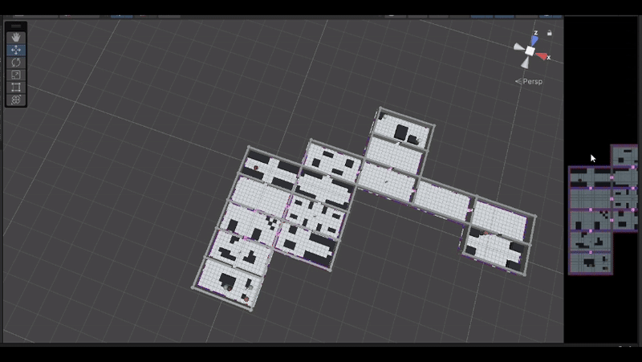

# TG-RL-Hospital
Repository for all codes and implementations on my undergraduate thesis.

This project investigates the use of Autonomous Mobile Robots (AMRs) with Multi-Agent Reinforcement Learning (MARL) to optimize the delivery of surgical instruments in hospital environments. A 3D simulation was developed using Unity and ML-Agents, enabling the training of agents in a variety of logistical tasks within procedurally generated hospital layouts. The MA-POCA algorithm was employed to train agents.

The methodology applies curriculum learning, progressively increasing the complexity of the scenarios, from single-room deliveries to large multi-room hospitals, so agents gradually acquire new skills. The trained agents demonstrated improved delivery efficiency, reduced delivery times, and effective obstacle avoidance throughout the curriculum stages.

Full thesis can be found [here](TG_II_Adriel_Final.pdf).

## Demonstrations

### Procedural Generation

### Delivery Example

